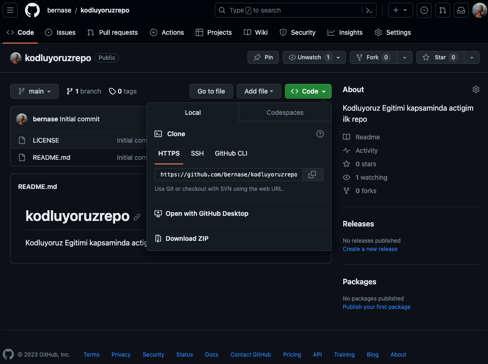

# Kodluyoruz Ilk Repo

Bu repo Kodluyoruz Front-End Egitiminde olusturdugumuz ilk repo. Icerisinde bir adet README dosyasi, bir adet de Index.html barindiriyor.

## Installation
Oncelikle projecyi clonelayin.

`git  clone https://github.com/bernase/kodluyoruzrepo.git`

## Usage
Projeyi cloneladiktan sonra Visual Studio Code programinda acin
`cd kodluyoruzilkrepo code`

## Contributing
Pull requestler kabul edilir. Buyuk degisiklikler icin. lutfen once neyi degistirmek istediginizi tartismak icin bir konu aciniz.

## License 
MIT

